# Bio-TikZ Gallery

Standalone TikZ figures on phylogenetic trees, networks, recombination, reassortment, and species history.

Each figure lives in `figures/` as a standalone `.tex` source with a compiled `.pdf` and a preview `.png` beside it. Shared colors, libraries, and TikZ styles live in `figures/_preamble.tex`.

## Foundations

### Four Ancestry and Contact Objects

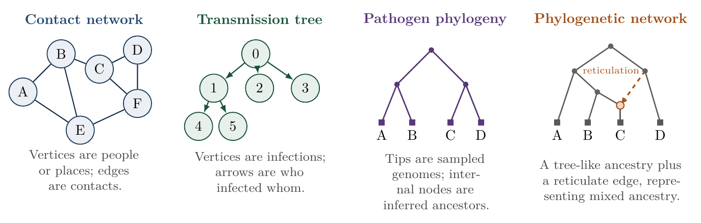

Source: [figures/fig-graph-forms.tex](figures/fig-graph-forms.tex)  
PDF: [figures/fig-graph-forms.pdf](figures/fig-graph-forms.pdf)

Contact networks describe possible contacts, transmission trees describe who infected whom, pathogen phylogenies describe genome ancestry under a tree assumption, and phylogenetic networks allow reticulate events such as recombination, reassortment, hybridisation, or horizontal gene transfer.

### Rooted and Unrooted Binary Trees

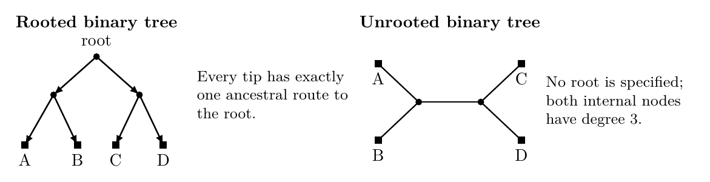

Source: [figures/fig-rooted-unrooted-binary-trees.tex](figures/fig-rooted-unrooted-binary-trees.tex)  
PDF: [figures/fig-rooted-unrooted-binary-trees.pdf](figures/fig-rooted-unrooted-binary-trees.pdf)

Rooted and unrooted binary phylogenetic trees. In both cases the defining tree property is absence of cycles.

### Network Display Types

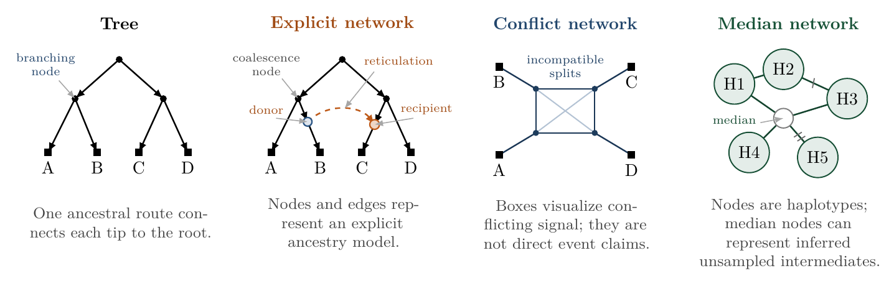

Source: [figures/fig-network-display-types.tex](figures/fig-network-display-types.tex)  
PDF: [figures/fig-network-display-types.pdf](figures/fig-network-display-types.pdf)

Four phylogenetic graph displays that should not be interpreted in the same way. A tree gives a single ancestry, an explicit phylogenetic network represents modeled reticulate ancestry, a conflict or split network displays incompatible signal, and a haplotype or median network summarizes relationships among closely related sequence types.

### Rooted Network Time Order

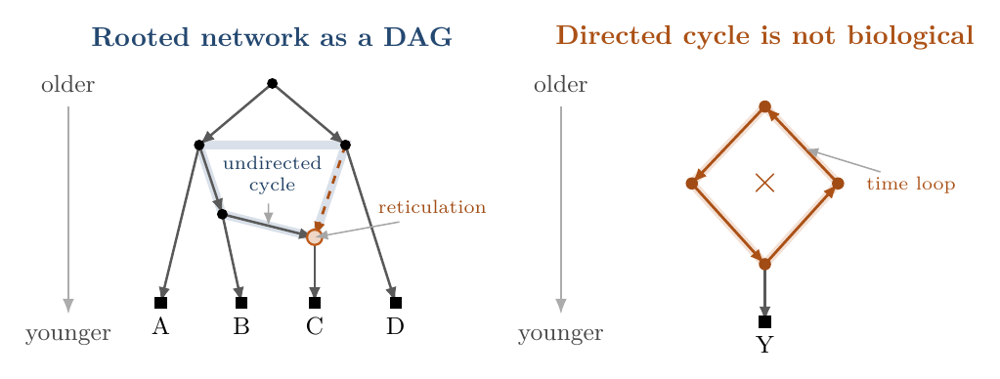

Source: [figures/fig-rooted-network-acyclic-time.tex](figures/fig-rooted-network-acyclic-time.tex)  
PDF: [figures/fig-rooted-network-acyclic-time.pdf](figures/fig-rooted-network-acyclic-time.pdf)

Rooted phylogenetic networks are usually interpreted as directed acyclic graphs. Reticulation can create a cycle in the underlying undirected graph, but arrows still follow a consistent older to younger time order.

### Tree Space and Network Space

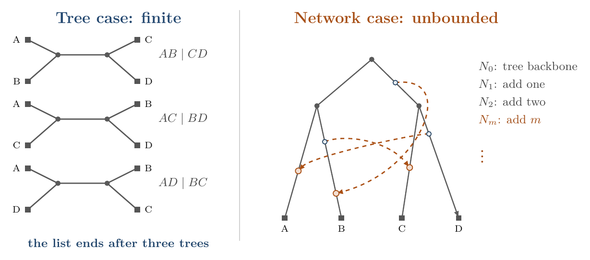

Source: [figures/fig-tree-space-network-space.tex](figures/fig-tree-space-network-space.tex)  
PDF: [figures/fig-tree-space-network-space.pdf](figures/fig-tree-space-network-space.pdf)

Tree space versus network space on a fixed leaf set. The left panel shows the entire unrooted binary tree space for four leaves. The right panel shows why unconstrained phylogenetic network space is unbounded: reticulate structures can be added repeatedly while the observed leaves remain A, B, C, and D.

## Recombination and Gene Flow

### Crossover Recombination

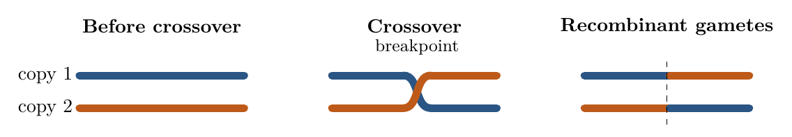

Source: [figures/fig-eukaryotes-crossover.tex](figures/fig-eukaryotes-crossover.tex)  
PDF: [figures/fig-eukaryotes-crossover.pdf](figures/fig-eukaryotes-crossover.pdf)

Crossover recombination creates a chromosome whose left and right parts may have different ancestral histories. Nearby sites are more likely to remain linked.

### Linkage and Breakpoint Distance

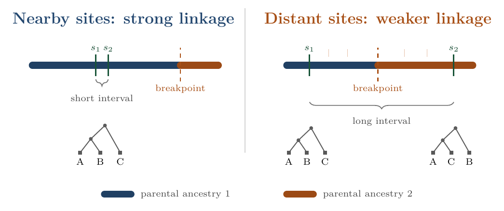

Source: [figures/fig-linkage-nearby-distant-sites.tex](figures/fig-linkage-nearby-distant-sites.tex)  
PDF: [figures/fig-linkage-nearby-distant-sites.pdf](figures/fig-linkage-nearby-distant-sites.pdf)

Two sites are separated by recombination only when a crossover breakpoint falls between them. Nearby sites have a short interval between them and tend to remain in the same ancestry block, while distant sites are more likely to have different local trees.

### HGT Addition and Gene Conversion

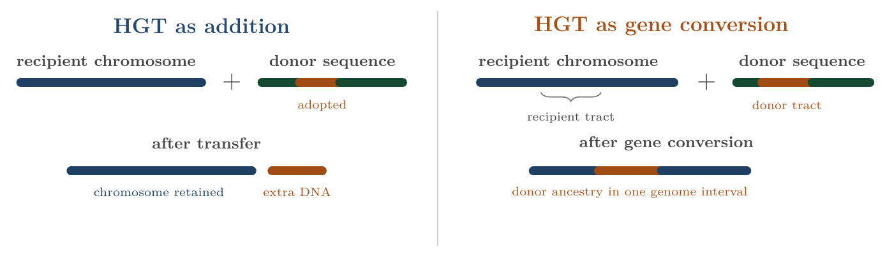

Source: [figures/fig-hgt-addition-vs-gene-conversion.tex](figures/fig-hgt-addition-vs-gene-conversion.tex)  
PDF: [figures/fig-hgt-addition-vs-gene-conversion.pdf](figures/fig-hgt-addition-vs-gene-conversion.pdf)

Horizontal gene transfer and homologous recombination are distinct. HGT can add DNA without replacing a homologous region, while homologous recombination after transfer can replace a recipient tract with donor derived DNA.

### Bacterial HGT Routes

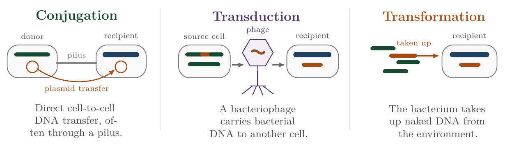

Source: [figures/fig-bacterial-hgt-routes.tex](figures/fig-bacterial-hgt-routes.tex)  
PDF: [figures/fig-bacterial-hgt-routes.pdf](figures/fig-bacterial-hgt-routes.pdf)

Three classical routes of bacterial horizontal gene transfer: conjugation, transduction, and transformation. Orange marks DNA adopted by the recipient; green marks DNA that is present but not adopted.

### Viral Reassortment

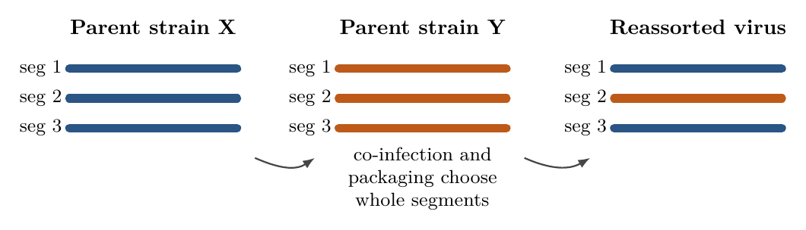

Source: [figures/fig-virus-reassortment.tex](figures/fig-virus-reassortment.tex)  
PDF: [figures/fig-virus-reassortment.pdf](figures/fig-virus-reassortment.pdf)

Reassortment assigns entire genome segments to parental lineages. It is especially important for segmented viruses such as influenza A.

### Local Trees Across Genome Intervals

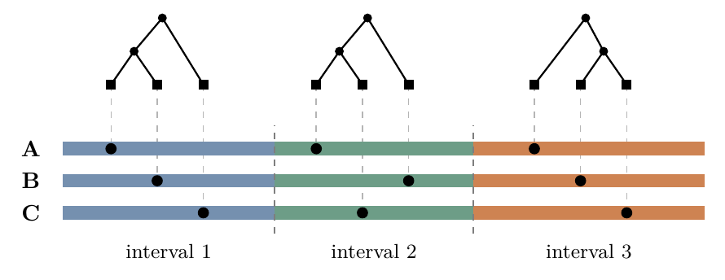

Source: [figures/fig-local-trees-genome-intervals.tex](figures/fig-local-trees-genome-intervals.tex)  
PDF: [figures/fig-local-trees-genome-intervals.pdf](figures/fig-local-trees-genome-intervals.pdf)

A recombinant alignment can be read as a sequence of genome intervals, each with its own local tree. Dashed guide lines connect each local-tree tip to the corresponding sampled genome row.

### Ancestral Recombination Graph

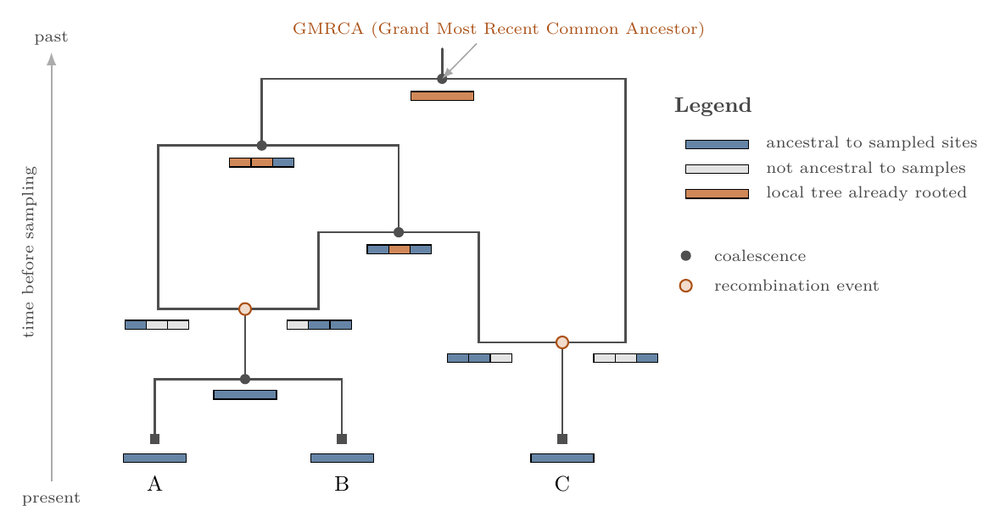

Source: [figures/fig-arg-coalescent-with-recombination.tex](figures/fig-arg-coalescent-with-recombination.tex)  
PDF: [figures/fig-arg-coalescent-with-recombination.pdf](figures/fig-arg-coalescent-with-recombination.pdf)

Backward in time, coalescence merges ancestral lineages and recombination splits one lineage into two parental lineages. The bars show which genome intervals remain ancestral to the sampled sequences.

## Species Histories

### Species Level Reticulation

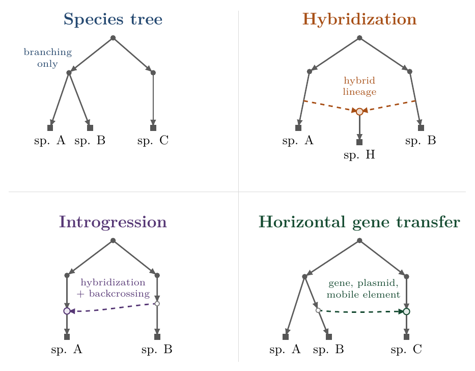

Source: [figures/fig-species-level-reticulation.tex](figures/fig-species-level-reticulation.tex)  
PDF: [figures/fig-species-level-reticulation.pdf](figures/fig-species-level-reticulation.pdf)

Hybridization forms a hybrid descendant lineage, introgression moves alleles or tracts through hybridization and backcrossing while both species persist, and horizontal gene transfer moves DNA across species boundaries without reproductive hybridization.

### Gene Trees Inside a Species History

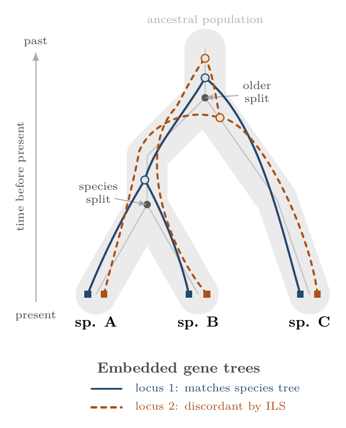

Source: [figures/fig-gene-trees-nested-in-species-history.tex](figures/fig-gene-trees-nested-in-species-history.tex)  
PDF: [figures/fig-gene-trees-nested-in-species-history.pdf](figures/fig-gene-trees-nested-in-species-history.pdf)

The gray tubes represent species or population branches. The blue gene tree matches the species tree, while the orange gene tree is discordant because some lineages fail to coalesce until the deeper ancestral population.
